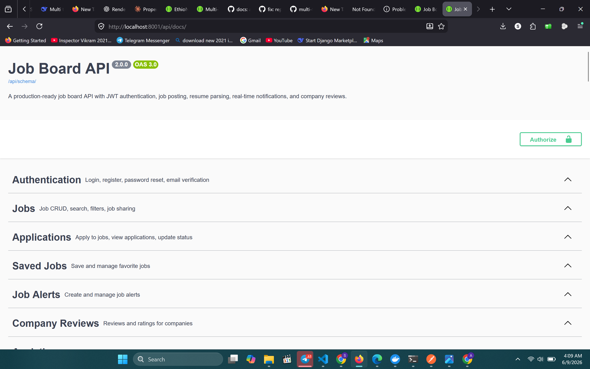
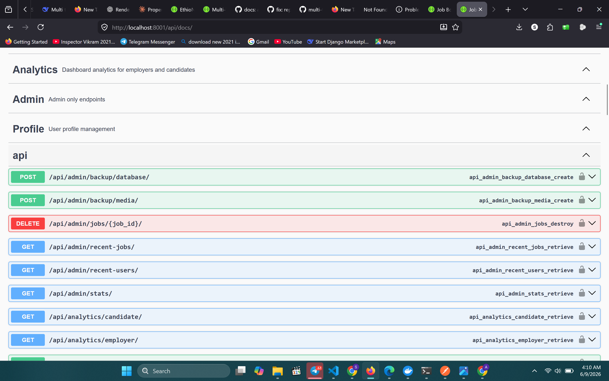
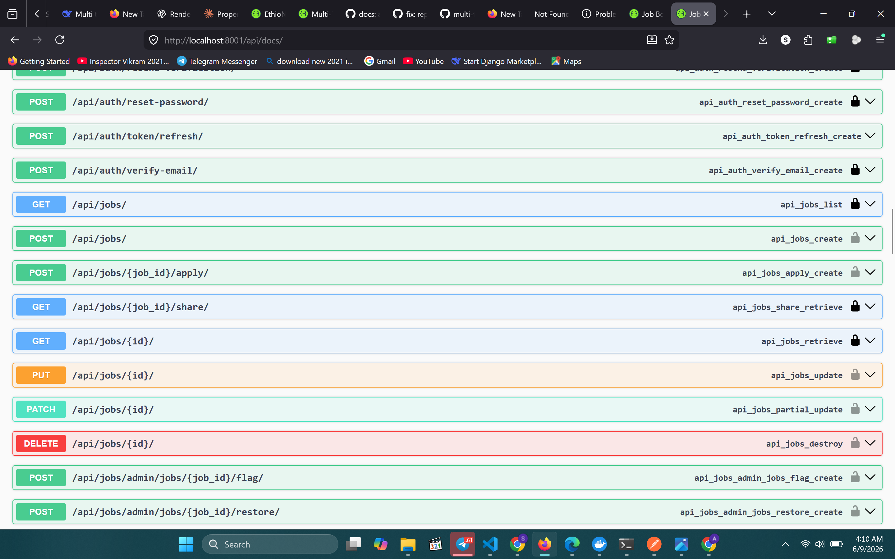
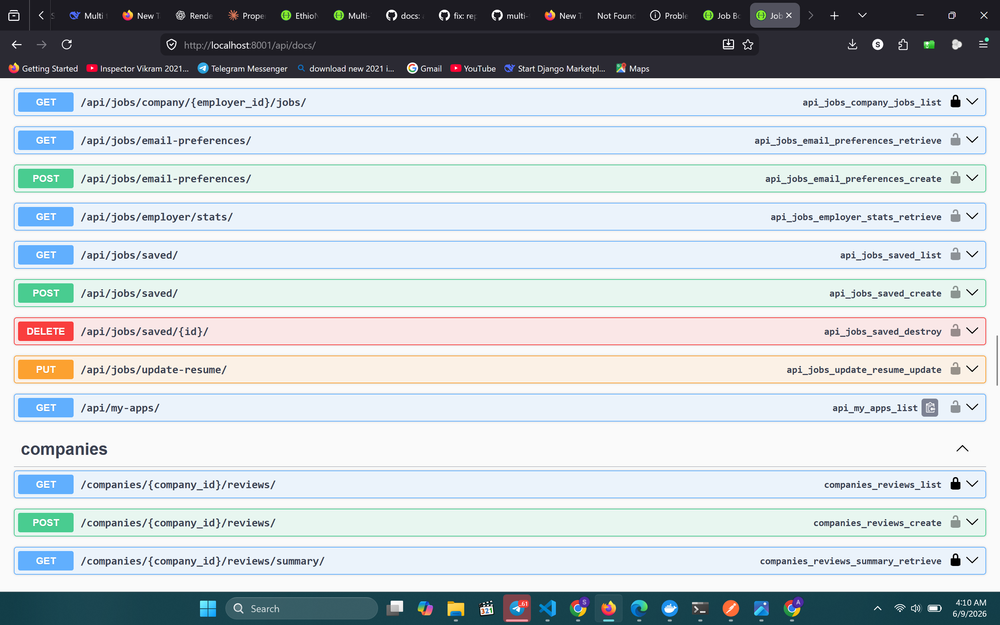

Here's the complete rewritten README for the Job Board Backend:
markdown

# Job Board Backend API


## 📊 Quality Metrics

- 87% code coverage
- 0 failed tests
- Unit + integration + permission + analytics test layers
- WebSocket consumer tests included
- Redis cache decorator tests included
- Role-based permission tests included

## 📸 API Documentation Preview

> Full interactive documentation available at `/api/docs/`

### Overview & Authentication


### Jobs & Applications


### Analytics & Saved Jobs


### Reviews & Admin


> A production-ready job board REST API — employers post and manage job listings, candidates apply and track application status in real time, admins oversee the platform. Built with Django REST Framework, PostgreSQL, Redis, Celery, Django Channels (WebSockets), and Docker.

## ⚡ Why This Project?

- `unique_together` on job + candidate — prevents duplicate applications
- `cache_for_jobs` decorator + `delete_pattern` — Redis cache with automatic invalidation
- Celery resume parser — extracts skills, email, phone in background
- Django Channels — WebSocket notifications per user in real time
- `is_deleted` flag — soft delete jobs, restore without data loss
- Aggregated analytics views — scoped per employer/candidate, no heavy joins


## ≡ Key Highlights

- JWT authentication with access/refresh tokens, email verification, and password reset
- Role-based access control ΓÇö Candidate, Employer, Admin
- Job listings with search, filtering, soft delete, and Redis caching
- Application system with resume upload, status tracking, and duplicate prevention
- Employer analytics: total jobs, active jobs, applications, views, top jobs
- Candidate analytics: total applications, saved jobs, active alerts
- Real-time WebSocket notifications via Django Channels
- Background email and notification processing via Celery
- 86% code coverage across unit, integration, permission, and analytics tests

---
## 🛠 Tech Stack

| Layer | Technology |
|-------|-----------|
| Backend | Django 5.2, Django REST Framework 3.15 |
| Database | PostgreSQL 16 |
| Cache & Broker | Redis 7 |
| Authentication | JWT (djangorestframework-simplejwt) |
| Background Tasks | Celery + Redis |
| Real-Time | Django Channels + WebSockets |
| API Docs | drf-spectacular (Swagger + ReDoc) |
| Testing | pytest, pytest-django, pytest-cov |
| Containerization | Docker, Docker Compose |

---

## 🏗 System Architecture

Client (Web / Mobile)
↓
Django REST API (Daphne ASGI)
↓
PostgreSQL 16        Redis 7
(Primary DB)    (Cache + Celery Broker)
↓
Celery Workers


---

## 📁 Project Structure

job-board-backend/
├── accounts/            # Auth, registration, email verification, password reset
├── jobs/                # Job listings, applications, saved jobs, alerts
│   ├── models.py        # Job, Application, SavedJob, JobAlert, StatusHistory
│   ├── views.py         # All job and application endpoints
│   ├── decorators.py    # cache_for_jobs, invalidate_job_cache
│   ├── analytics.py     # Employer and candidate analytics views
│   ├── tasks.py         # Resume parsing, email notifications
│   └── consumers.py     # WebSocket notification consumers
├── reviews/             # Company reviews
├── backup/              # Database backup views
├── config/              # Settings, URLs, cache, permissions, throttling
└── tests/               # Full test suite


---

## 📡 API Endpoints

### Authentication — `/api/auth/`

| Method | Endpoint | Description | Auth |
|--------|----------|-------------|------|
| POST | `register/` | Register + send verification email | Public |
| POST | `login/` | Login, receive JWT tokens | Public |
| POST | `token/refresh/` | Refresh access token | Public |
| GET/PATCH | `profile/` | View and update profile | JWT |
| POST | `verify-email/` | Verify email token | Public |
| POST | `resend-verification/` | Resend verification email | Public |
| POST | `password-reset/` | Request password reset link | Public |
| POST | `password-reset/confirm/` | Confirm and set new password | Public |
| POST | `update-password/` | Change password | JWT |
| DELETE | `delete-account/` | Soft delete account | JWT |

### Jobs — `/api/jobs/`

| Method | Endpoint | Description | Auth |
|--------|----------|-------------|------|
| GET | `/` | List jobs (cached, filterable, searchable) | Public |
| POST | `/` | Create job listing | Employer |
| GET | `<id>/` | Job detail | Public |
| PUT/PATCH | `<id>/` | Update own job | Employer |
| DELETE | `<id>/` | Soft delete own job | Employer |
| POST | `<job_id>/apply/` | Apply to a job | Candidate |
| GET | `applications/my/` | List own applications | Candidate |
| GET | `applications/employer/` | List applications for employer's jobs | Employer |
| PATCH | `applications/<id>/status/` | Update application status | Employer |
| POST | `applications/<id>/withdraw/` | Withdraw application | Candidate |
| POST | `applications/<id>/update-resume/` | Update resume on application | Candidate |

### Saved Jobs & Alerts — `/api/jobs/`

| Method | Endpoint | Description | Auth |
|--------|----------|-------------|------|
| GET/POST | `saved/` | List or save a job | Candidate |
| DELETE | `saved/<id>/` | Unsave a job | Candidate |
| GET/POST | `alerts/` | List or create job alerts | Candidate |
| DELETE | `alerts/<id>/` | Delete a job alert | Candidate |

### Analytics — `/api/analytics/`

| Method | Endpoint | Description | Auth |
|--------|----------|-------------|------|
| GET | `employer/` | Total jobs, views, applications, top jobs | Employer |
| GET | `candidate/` | Total applications, saved jobs, active alerts | Candidate |

### Reviews — `/api/`

| Method | Endpoint | Description | Auth |
|--------|----------|-------------|------|
| GET/POST | `reviews/` | List or create company reviews | JWT |
| GET/PATCH/DELETE | `reviews/<id>/` | Review detail | JWT (owner) |

### WebSockets

| Type | URL | Description | Auth |
|------|-----|-------------|------|
| WS | `ws://.../ws/notifications/` | Real-time job notifications | JWT |

---

## 💡 Example API Usage

**Register as a candidate:**
```bash
curl -X POST http://localhost:8001/api/auth/register/ \
  -H "Content-Type: application/json" \
  -d '{
    "email": "candidate@example.com",
    "username": "andualem",
    "password": "SecurePass123",
    "password2": "SecurePass123",
    "role": "candidate"
  }'
```

**Post a job (employer):**
```bash
curl -X POST http://localhost:8001/api/jobs/ \
  -H "Authorization: Bearer <access_token>" \
  -H "Content-Type: application/json" \
  -d '{
    "title": "Senior Django Developer",
    "description": "We need an experienced Django developer...",
    "location": "Addis Ababa",
    "employment_type": "full",
    "expires_at": "2026-12-31T00:00:00Z"
  }'
```

**Apply to a job:**
```bash
curl -X POST http://localhost:8001/api/jobs/1/apply/ \
  -H "Authorization: Bearer <access_token>" \
  -F "resume=@/path/to/resume.pdf" \
  -F "cover_letter=I am excited to apply..."
```

**Get employer analytics:**
```bash
curl http://localhost:8001/api/analytics/employer/ \
  -H "Authorization: Bearer <access_token>"
```

---

## ⚡ Performance Strategy

### Redis Caching
- Job listings cached per URL path with 15-minute TTL
- `cache_for_jobs` decorator forces JSON rendering before pickling
- `invalidate_job_cache` uses `delete_pattern("job_list_*")` on any write

### Database Optimization
- Indexes on `employer`, `is_active`, `location`, `salary_min/max`, `is_deleted`
- `select_related()` for ForeignKey traversals
- Soft delete with `is_deleted` flag — no data loss on job removal
- `unique_together` on `(job, candidate)` prevents duplicate applications

---

## ⚙️ Background Tasks (Celery)

| Task | Trigger |
|------|---------|
| Send verification email | On registration |
| Send password reset email | On forgot password |
| Parse resume | On application submitted |
| Send application notification | On status change |
| Send job alert emails | Periodic — matching new jobs |

---

## 🔐 Security

- JWT with blacklisting on logout
- Rate limiting on auth and application endpoints
- CORS protection
- Role-based permissions: `IsCandidate`, `IsEmployer`, `IsAdminUser`
- Soft delete on jobs and accounts — no hard deletes
- Input validation via DRF serializers

---

## 🧪 Testing

```bash
# Run full test suite inside Docker
docker-compose exec backend pytest --tb=short -q

# With coverage report
docker-compose exec backend pytest --cov=. --cov-report=term-missing

# Specific module
docker-compose exec backend pytest tests/test_analytics.py -v
```

### ✅ Test Results: 86% coverage

| Module | Coverage |
|--------|----------|
| `accounts/tasks.py` | 100% |
| `jobs/analytics.py` | 100% |
| `jobs/decorators.py` | 100% |
| `jobs/serializers.py` | 98% |
| `accounts/models.py` | 95% |
| `tests/conftest.py` | 95% |
| `jobs/notifications_utils.py` | 89% |
| `jobs/tasks.py` | 90% |
| `jobs/models.py` | 86% |
| `reviews/views.py` | 100% |

### Test Breakdown

| Category | Tests |
|----------|-------|
| Authentication & accounts | ✅ `test_auth.py` |
| Job listings & CRUD | ✅ `test_jobs.py` |
| Applications | ✅ `test_applications.py` |
| Analytics (employer + candidate) | ✅ `test_analytics.py` |
| Permissions & roles | ✅ `test_permissions.py` |
| Cache decorators | ✅ `test_decorators.py` |
| Email tasks | ✅ `test_email.py` |
| Notifications utils | ✅ `test_jobs_notifications_utils.py` |
| Celery tasks | ✅ `test_accounts_tasks.py` |
| Integration flows | ✅ `test_integrations.py` |
| Security | ✅ `test_security.py` |
| Reviews | ✅ `test_reviews.py` |

---

## 🎯 Design Decisions

**`cache_for_jobs` decorator** — caches job list responses in Redis. DRF `Response` objects are lazy and must be rendered before pickling. The decorator forces `response.render()` with a JSON renderer before calling `cache.set()`, preventing `ContentNotRenderedError`.

**Soft delete on jobs** — employers can restore deleted jobs. `is_deleted=True` hides from public listings but preserves all application history and audit trails.

**Employer/candidate analytics** — dedicated `EmployerAnalyticsView` and `CandidateAnalyticsView` aggregate data per user without expensive joins — scoped entirely to the authenticated user's data.

**Role-based access** — `User.role` is a `CharField` with choices `candidate/employer/admin`. `is_employer` and `is_candidate` are `@property` methods — not DB columns — keeping the model lean.

**Resume parsing via Celery** — parsing happens asynchronously after application submission so the HTTP response returns immediately. Extracted fields (`parsed_email`, `parsed_phone`, `extracted_skills`) are stored on the `Application` model.

---

## 📦 Quick Start

```bash
git clone https://github.com/andugetachew/job-board-backend.git
cd job-board-backend
cp .env.example .env
docker-compose up --build
```

- API: `http://localhost:8001/`
- Swagger Docs: `http://localhost:8001/api/docs/`
- Admin Panel: `http://localhost:8001/admin/`

---

## 🔑 Environment Variables

```env
SECRET_KEY=your-secret-key
DEBUG=False
ALLOWED_HOSTS=localhost,127.0.0.1

DB_NAME=jobboard_db
DB_USER=postgres
DB_PASSWORD=yourpassword
DB_HOST=db
DB_PORT=5432

REDIS_URL=redis://redis:6379/0
CELERY_BROKER_URL=redis://redis:6379/0
CELERY_RESULT_BACKEND=redis://redis:6379/0

EMAIL_HOST=smtp.gmail.com
EMAIL_PORT=587
EMAIL_HOST_USER=your@email.com
EMAIL_HOST_PASSWORD=your-app-password
EMAIL_USE_TLS=True
DEFAULT_FROM_EMAIL=noreply@jobboard.com

FRONTEND_URL=http://localhost:3000
```

---

## 🐳 Docker Services

```bash
docker-compose up --build
```

| Service | Description | Port |
|---------|-------------|------|
| backend | Django + Daphne (ASGI) | 8001 |
| db | PostgreSQL 16 | 5432 |
| redis | Cache + Message broker | 6380 |
| celery | Background task worker | — |

---

## 📄 License

MIT License

---

## 👨‍💻 Author

**Andualem Getachew**

[](https://github.com/andugetachew)
[](mailto:andugeta41@gmail.com)